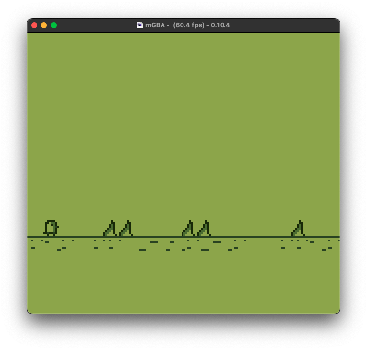
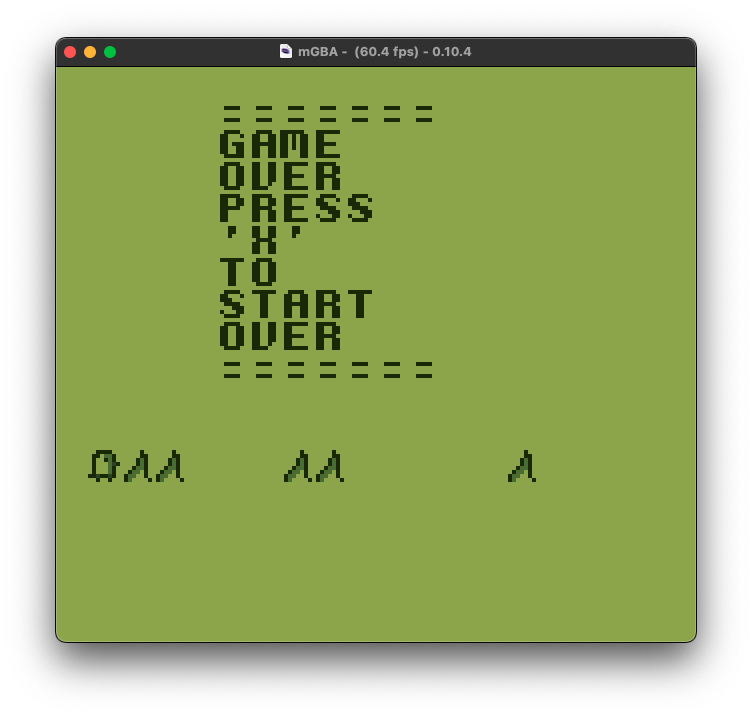

# Jumper game for the Game Boy

Help a penguin escape Antarctica.




## Dependencies

- [GBDK][GBDK] Game Boy Development Kit
- [mGBA][mGBA] Game Boy emulator
- C Compiler (gcc, ...)

## Build instructions

```sh
# Clone this repo
git clone https://github.com/chudware/jumper.git
cd jumper

# Create a build folder
mkdir build
cd build

# Build
make

# Run
mgba ./build/_Game.gb
```

***Note:*** To use the GBDK you will have to install it from it's GitHub page.

[GBDK]: https://github.com/gbdk-2020/gbdk-2020
[mGBA]: https://mgba.io/
[Git]: https://git-scm.com